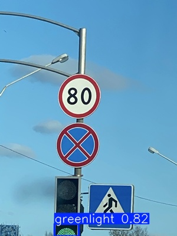
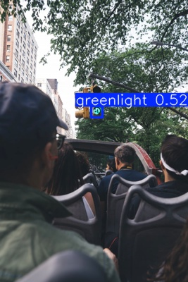
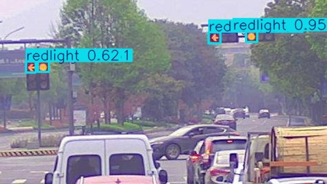
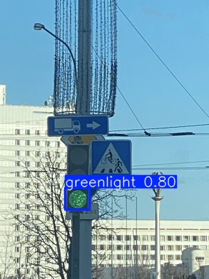
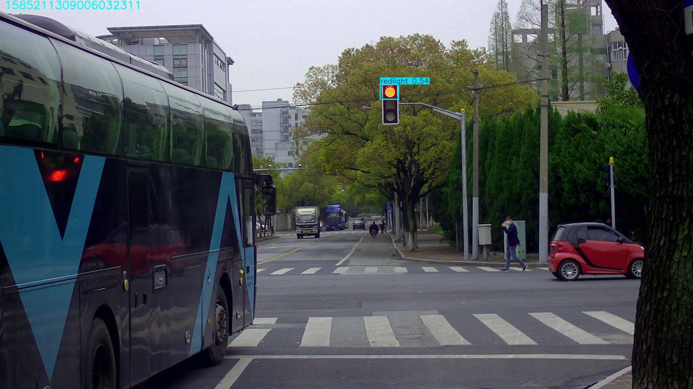
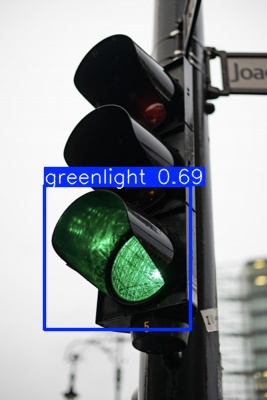

# Simple Traffic Light Detection using YOLO11

This is a simple sample project created to try and learn YOLO11 object detection using custom traffic-light data.

The project detects:

- Red traffic lights
- Green traffic lights

on:

- Images
- Videos

using a custom-trained YOLO11 model.

---

# Project Structure

```text
object-detection-yollo11/
│
├── runs/
├── test/
├── train/
├── val/
│
├── dataset_custom.yaml
├── predict.py
├── train.py
│
├── yolo26n.pt
├── yolov11_custom.pt
```

---

# Technologies Used

- Python
- PyTorch
- Ultralytics YOLO11
- OpenCV

---

# Dataset

Custom traffic-light dataset containing:

- Green traffic lights
- Red traffic lights

Classes:

```text
0 → greenlight
1 → redlight
```

---

# Training

Train the model using:

```bash
python train.py
```

Example training configuration:

```python
model.train(
    data='dataset_custom.yaml',
    epochs=100,
    imgsz=640,
    batch=8,
    device=0,
    workers=0
)
```

---

# Inference

Run prediction on images/videos:

```bash
python predict.py
```

Example:

```python
model.predict(
    source='1.png',
    save=True,
    conf=0.5
)
```

---

# Custom Trained Model

The trained model file:

```text
yolov11_custom.pt
```

---

# Prediction Examples

## Image Predictions

### Example 1



### Example 2



### Example 3



### Example 4



### Example 5



### Example 6



---

# Video Predictions

## Video Example 1

https://github.com/user-attachments/assets/1.mp4

---

## Video Example 2

https://github.com/user-attachments/assets/2.mp4

---

# Installation

Clone the repository:

```bash
git clone https://github.com/Asmaathabet/Traffic-Light-Detection.git
```

Install dependencies:

```bash
pip install ultralytics opencv-python
```

---

# Notes

- This project is a simple practice/sample project for learning YOLO11.
- The model was trained on a small custom dataset.
- Results may improve with a larger dataset and longer training.

---

# Future Improvements

- Add yellow traffic light detection
- Improve dataset size
- Real-time webcam inference
- Deploy on mobile using Flutter
