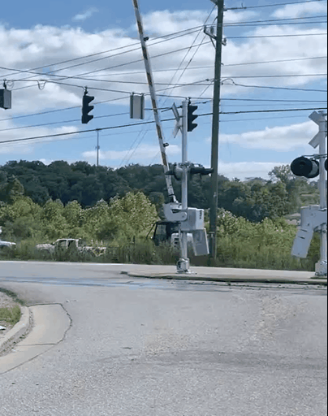

# Simple Traffic Light Detection using YOLO26

This is a simple sample project created to try and learn YOLO26 object detection using custom traffic-light data.

The project detects:

- Red traffic lights
- Green traffic lights

on:

- Images
- Videos

using a custom-trained YOLO26 model.

---

# Project Structure

```text
object-detection-yollo26/
│
├── runs/
├── test/
├── train/
├── val/
│
├── dataset_custom.yaml
├── predict.py
├── train.py
│
├── yolo26n.pt
├── yolov26_custom.pt
```

---

# Technologies Used

- Python
- PyTorch
- Ultralytics YOLO26
- OpenCV

---

# Dataset

Dataset used: (I used small group of images)
https://www.kaggle.com/datasets/amlyasser/generated-traffic-light?resource=download

Custom traffic-light dataset containing:

- Green traffic lights
- Red traffic lights

Classes:

```text
0 → greenlight
1 → redlight
```

---

# Annotation Tool

The dataset annotations were created using Label Studio for object detection bounding-box labeling of traffic lights.

---

# Training

Train the model using:

```bash
python train.py
```

Example training configuration:

```python
model.train(
    data='dataset_custom.yaml',
    epochs=100,
    imgsz=640,
    batch=8,
    device=0,
    workers=0
)
```

---

# Training Results

Model evaluation results on the validation dataset:

| Class      | Precision | Recall | mAP50 | mAP50-95 |
| ---------- | --------- | ------ | ----- | -------- |
| greenlight | 1.000     | 0.976  | 0.995 | 0.868    |
| redlight   | 1.000     | 0.660  | 0.935 | 0.688    |
| ALL        | 1.000     | 0.818  | 0.965 | 0.778    |

---

# Validation Metrics

- Overall mAP50: **0.965**
- Overall mAP50-95: **0.778**
- Detection model: **YOLO26n**
- Training device: **NVIDIA GeForce MX130**
- Epochs: **100**

---

# Notes About Results

- The model achieved strong object detection performance on traffic-light images.
- Green traffic lights achieved higher recall performance than red traffic lights.
- Results can improve further with:
  - larger datasets
  - additional training images
  - more data augmentation
  - GPU training on newer hardware

---

# Inference

Run prediction on images/videos:

```bash
python predict.py
```

Example:

```python
model.predict(
    source='1.png',
    save=True,
    conf=0.5
)
```

---

# Custom Trained Model

The trained model file:

```text
yolov26_custom.pt
```

---

# Prediction Examples

## Image Predictions

### Example 1


### Example 2


### Example 3


### Example 4


### Example 5


### Example 6


---

# Video Predictions

## Video Example 1

https://github.com/Asmaathabet/Traffic-Light-Detection/issues/1


---

## Video Example 2

https://github.com/Asmaathabet/Traffic-Light-Detection/issues/2



---

# Installation

Clone the repository:

```bash
git clone https://github.com/Asmaathabet/Traffic-Light-Detection.git
```

Install dependencies:

```bash
pip install ultralytics opencv-python
```

---

# Notes

- This project is a simple practice/sample project for learning YOLO26.
- The model was trained on a small custom dataset.
- Results may improve with a larger dataset and longer training.

---

# Future Improvements

- Add yellow traffic light detection
- Improve dataset size
- Real-time webcam inference
- Deploy on mobile using Flutter
